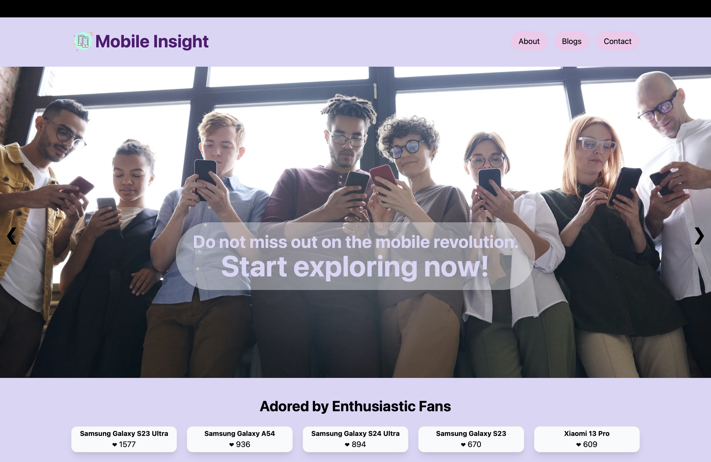

### Mobile Insight: Mobile Information Website

Welcome to Mobile Insight, your go-to destination for mobile information and insights. With a sleek and intuitive design, Mobile Insight provides users with access to a wealth of information about mobile devices, along with a dedicated blog section to stay updated on the latest trends and news in the mobile industry. Powered by Next.js and React, Mobile Insight offers a seamless browsing experience for users seeking comprehensive mobile insights.

---

#### About

Mobile Insight is developed and maintained by [Md Musfikur Rahman](https://musfikur.com). We are passionate about providing users with valuable insights and information to navigate the world of mobile devices. Join us on this journey as we continue to innovate and empower users with Mobile Insight.

---

#### Technologies Used

- **React**: A JavaScript library for building user interfaces, providing dynamic and interactive components for an engaging browsing experience.
- **Next.js**: A React framework for building server-side rendered and statically generated web applications, offering improved performance and SEO capabilities.
- **Tailwind CSS**: A utility-first CSS framework for building responsive and customizable user interfaces with ease, allowing for consistent styling and layout across all pages.

---

#### Features

- **Mobile Information**: Access comprehensive details about mobile devices, including specifications, features, and pricing.
- **API Integration**: Utilize an API to fetch real-time mobile information, ensuring data accuracy and reliability.
- **Blog Section**: Stay updated on the latest news, reviews, and insights in the mobile industry through the dedicated blog section.
- **Responsive Design**: Enjoy a seamless browsing experience across devices, thanks to the responsive design and layout optimization.

---

#### Mission Statement

At Mobile Insight, our mission is to empower users with valuable insights and information to make informed decisions about mobile devices. We believe in transparency, accuracy, and accessibility, and strive to provide a user-friendly platform that caters to the diverse needs of mobile enthusiasts and professionals. With Mobile Insight, users can stay ahead of the curve and make informed choices in an ever-evolving mobile landscape.

---

#### Deployment

Mobile Insight is deployed on Vercel, ensuring reliable hosting and accessibility. The deployment process is automated and streamlined, allowing for quick updates and optimizations.

**Live Link**: [Mobile Insight Website Demo](https://mobile-hub.vercel.app)

To deploy Mobile Insight:
1. Clone the repository from GitHub.
2. Install dependencies using npm or yarn.
3. Configure environment variables as necessary.
4. Connect the project to the deployment platform and deploy using the provided tools or scripts.
5. Monitor the deployment status and access the live application URL.

---

#### Contributing

Contributions to Mobile Insight are welcome! Whether you want to suggest new features, report bugs, or contribute to the codebase, please follow these guidelines:
- Fork the repository and create a new branch for your changes.
- Commit your changes with descriptive messages.
- Open a pull request, explaining the purpose and impact of your changes.
- Participate in discussions and address feedback to ensure the quality of contributions.

---

#### Contact

For inquiries, feedback, or support, please contact the project maintainer(s) at [contact@musfikur.com](mailto:contact@musfikur.com).

---

**Screenshot**:

